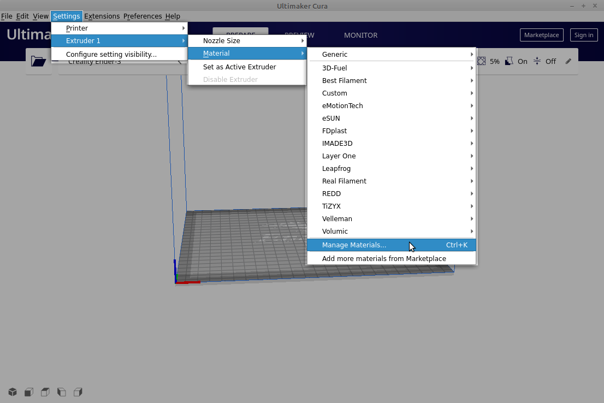
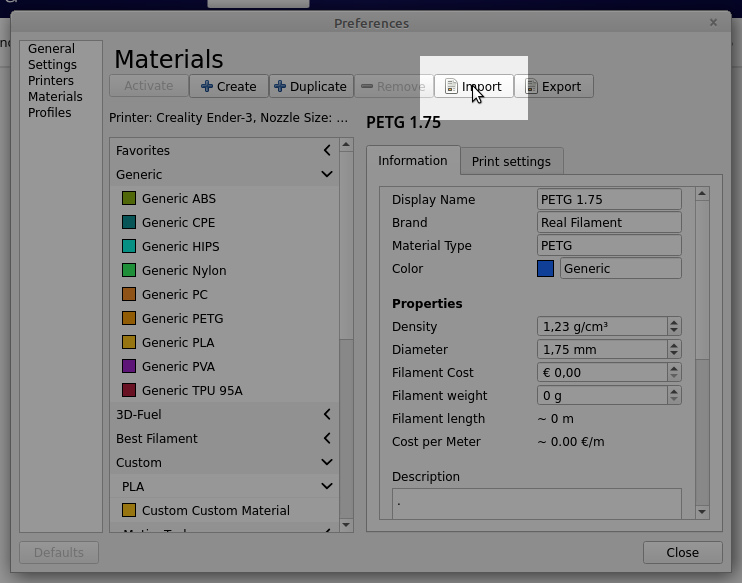

# Real Filament profiles

This git repository is dedicated to sharing slicing software printing profiles for Real filament products. For more information on Real filament products see https://real-filament.com

## Cura profiles

The download contains a subfolder Cura with profiles compatible with Ultimaker Cura software. To install profiles in Cura follow these steps. First open the material preferences dialog:

In the material preferences click the import button:

Find the material profile in the Cura subfolder of the extracted Real Filaments profiles download and open it. Now you can use the profile to slice your favorite 3D print.
