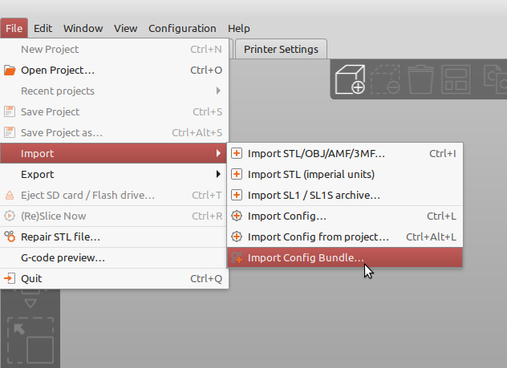

# Real Filament profiles

This git repository is dedicated to sharing slicing software printing profiles for Real filament products. For more information on Real filament products see https://real-filament.com

## Cura profiles

The download contains a subfolder Cura with profiles compatible with Ultimaker Cura software. To install profiles in Cura follow these steps. First open the material preferences dialog:

In the material preferences click the import button:

Find the material profile in the Cura subfolder of the extracted Real Filaments profiles download and open it. Now you can use the profile to slice your favorite 3D print.

## PrusaSlicer profiles

The PrusaSlicer directory includes profiles rouped by 3D printer brand. To load profiles, find the import config bundle option in the main menu.

Select the downloaded ini file from the directory and click open. Under the filament tab alle Real filament profiles should be now available.
